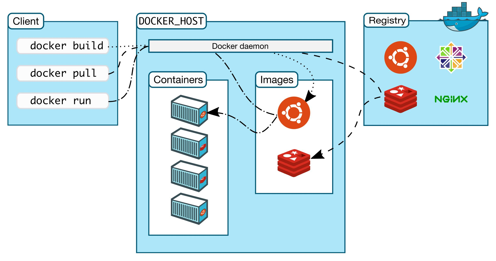

# Docker Time

## The Importance of Docker for Productivity in Companies

#### What is Docker? 

Docker creates a container of all of your applications dependencies. The containerized method makes running your application easier to deploy and run in linux environments. Docker creates an image using a docker file specifying the components needed for code deployment. For example, if you want to run your code on an empty server. The docker image containing the needed components will upload those configurations to the server and allow the code to run flawlessly.
For more information about docker, please click [here!](https://docs.docker.com/get-started/overview/)

#### How can Docker improve productivity and competitiveness?

Docker allows developers to focus on creating code, without worrying if the framework will be set in the environment. It separates the application from the infrastructure for you to easy manage and decrease delay while testing/running your code. The container will hold all necessary components needed for the application to run. 
Docker is an efficient way to bring your application to the production environment quickly.

Docker has the following features: 

- Fast, consistent delivery of your applications
- Responsive deployment and scaling
- Running more workloads on the same hardware

To download docker, please go to [download](https://hub.docker.com/search?q=&type=edition&offering=community&sort=updated_at&order=desc).

#### Docker Architecture 

To download docker, please go to [download](https://hub.docker.com/search?q=&type=edition&offering=community&sort=updated_at&order=desc).

#### Next Page: [Automated Testing](https://github.com/vfm2/is601-miniproject/blob/main/autoTest.md)
#### Previous Page: [Git](https://github.com/vfm2/is601-miniproject/blob/main/gitPage.md)
#### Back to [README.md](https://github.com/vfm2/is601-miniproject/blob/main/README.md)
